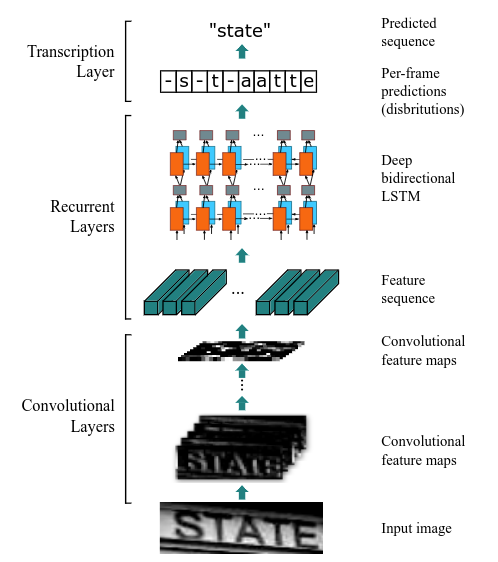
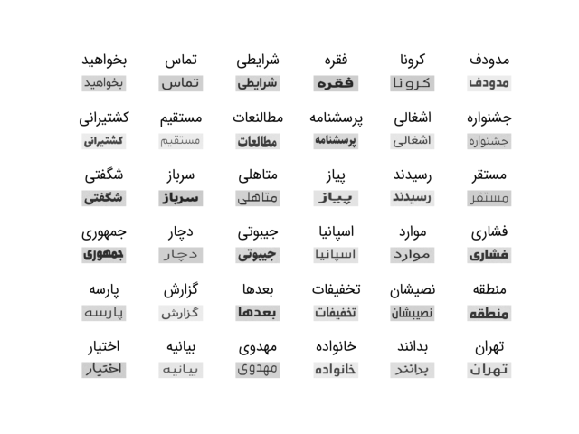

# Scene Text Recognition
Text recognition (optical character recognition) with deep learning methods in farsi.
#### **Quick Links**
- [Dependencies](#Dependencies)
- [Getting Started](#Getting-Started)
- [Training](#Training)
- [Samples](#Samples)
- [References](#References)
- [License](#License)

## Dependencies
- Install Dependencies `$ pip install -r requirements.txt`
- Download model weights [Here](), place it in ``

## Getting Started
<p align="center">
  
</p>

- Project Structure
```
.
├── src
│   ├── nn
│   │   ├── feature_extractor.py
│   │   ├── layers.py
│   │   └── ocr_model.py
│   └── utils
│       ├── dataset.py
│       ├── labelConverter.py
│       ├── loss_calculator.py
│       ├── misc.py
│       └── transforms.py
├── config.py
├── LICENSE
├── main.py
├── README.md
├── requirements.txt
├── test.py
└── train.py
```

- place dataset path in `config.py` file.
```python
ds_path = {
    "train_ds" : "path/to/train/dataset",
    "test_ds" : "path/to/test/dataset",
    "val_ds" : "path/to/val/dataset",
}
```

- DataSet Structure (Each image must eventually contain a word)
```
.
├── Images
│   ├── img_1.jpg
│   ├── img_2.jpg
│   ├── img_3.jpg
│   ├── img_4.jpg
│   ├── img_5.jpg
│
│   ...
│
└── labels.json
```

- `labels.json` Contents
```json
{"img_1": "بالا", "img_2": "و", "img_3": "بدانند", "img_4": "چندین", "img_5": "به", ...}
```
## Training

### Objective Function
Denote the training dataset by $\ TD = \langle X_i , Y_i \rangle\$ where $\ X_i$ is the training image and $\ Y_i$ is the word label. The training conducted by minimizing the objective function that negative log-likelihood of the conditional probability of word label.
```math
O = -\sum_{(X_i, Y_i) \in TD} \log P(Y_i|X_i)
```
This function calculates a cost from an image and its word label, and the modules in the framework are trained end-to-end manner.

### CTC Loss
CTC takes a sequence $\ H = h_1 , . . . , h_T$ , where $\ T$ is the sequence length, and outputs the probability of $\ pi$, which is defined as
```math
P(\pi|H) = \prod_{t = 1}^T y_{{\pi}_t}^t
```
where $\ y_{{\pi}_t}^t$ t is the probability of generating character $\ \pi_t$ at each time step $\ t$.

## Samples
<p align="center">
  
</p>

## References
- [What Is Wrong With Scene Text Recognition Model Comparisons? Dataset and Model Analysis](https://arxiv.org/abs/1904.01906)
- [An End-to-End Trainable Neural Network for Image-based Sequence Recognition and Its Application to Scene Text Recognition](https://arxiv.org/abs/1507.05717)
- [Text recognition (optical character recognition) with deep learning methods, ICCV 2019 ](https://github.com/clovaai/deep-text-recognition-benchmark)

## 🛡️ License <a name="license"></a>
Project is distributed under [MIT License](https://github.com/Saeed-Biabani/Scene-Text-Recognition/blob/main/LICENSE)
